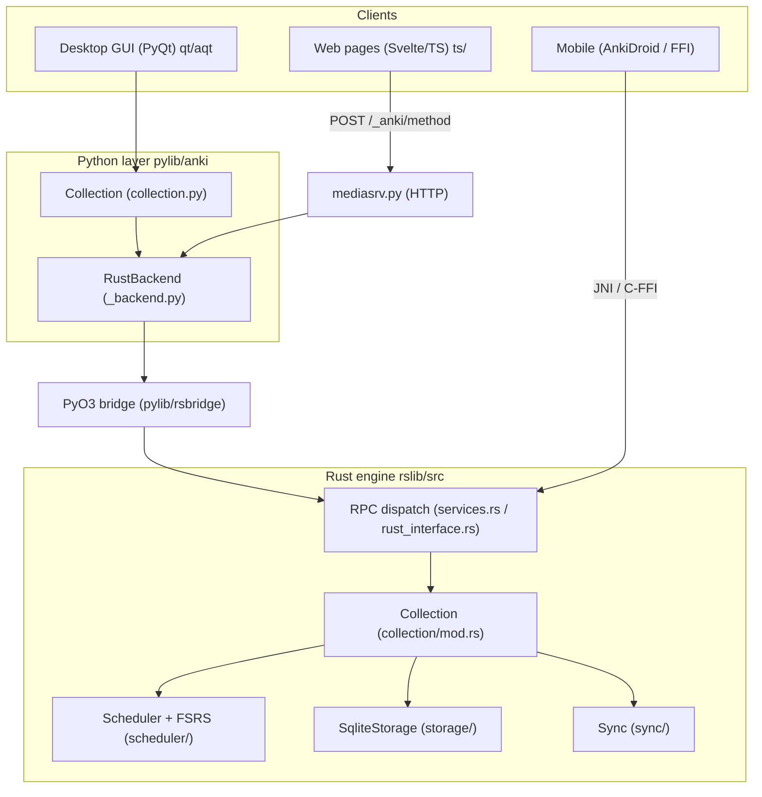

# Speedrun / Anki Fork — Codebase Guide

> A working map of the Anki codebase for the Speedrun team, oriented toward
> making changes quickly. Anki is a multi-layer app: a Rust engine (`rslib/`),
> a Python library wrapping it (`pylib/`), a PyQt desktop GUI (`qt/`), and a
> Svelte/TypeScript web frontend (`ts/`). The layers talk over **protobuf RPC**.
>
> See [prd.md](prd.md) for product goals. This doc is purely about _how the code
> is organized and where to change things_.

## Table of contents

- [Key findings & gotchas (read this first)](#key-findings--gotchas-read-this-first)

1. [Big picture](#1-big-picture)
2. [Repo layout](#2-repo-layout)
3. [Build system & dev workflow](#3-build-system--dev-workflow)
4. [Rust core (`rslib`)](#4-rust-core-rslib)
5. [Scheduler & FSRS](#5-scheduler--fsrs)
6. [Protobuf & cross-language RPC](#6-protobuf--cross-language-rpc)
7. [Python & Qt layer (`pylib`, `qt/aqt`)](#7-python--qt-layer-pylib-qtaqt)
8. [TypeScript / Svelte frontend (`ts`)](#8-typescript--svelte-frontend-ts)
9. [Sync architecture](#9-sync-architecture)
10. [Speedrun extension points (consolidated)](#10-speedrun-extension-points-consolidated)
11. [Quick-reference file index](#11-quick-reference-file-index)

---

## 1. Big picture



Key ideas:

- **`Collection` is the central object.** Almost all engine logic is `impl Collection { ... }` blocks spread across modules. It owns the SQLite storage and the undo manager.
- **Every cross-language call is a protobuf RPC.** A method is declared once in `proto/anki/*.proto`, then code generation produces Rust traits, Python methods, and TS functions. The wire format is `(service_index, method_index, bytes)`.
- **The web frontend talks HTTP** to a local server (`mediasrv.py`) that forwards to the backend; the desktop Python talks directly through the PyO3 bridge.
- **One engine, many frontends.** A Rust change ships to desktop _and_ mobile because they compile the same `rslib`.

---

## Key findings & gotchas (read this first)

The highest-leverage facts discovered while mapping the codebase. Details and
file/line references are in the linked sections.

1. **The interleaving queue has a clean, FSRS-safe insertion point.** Review
   ordering today is SQL-driven (`review_order_sql()`), but topic interleaving is
   a _constraint on consecutive cards_, not a sort key. The right place is a
   **post-gather permutation** in `QueueBuilder::build`
   (`rslib/src/scheduler/queue/builder/mod.rs:186`). Reordering is safe **as long
   as you only permute the gathered `Vec<DueCard>` / `Vec<NewCard>` and never
   touch `due` / `interval` / `memory_state`.** FSRS runs only at answer time, not
   during queue building. See [section 5](#5-scheduler--fsrs).

2. **There is no "weakness" or "topic" concept in the scheduler yet.** Topic info
   must come from **note tags** (cards carry no tags), and a weakness signal can be
   derived from the **existing FSRS `difficulty` / retrievability** already stored
   on each card — no need to invent or recompute anything. See
   [section 5.5](#55-existing-signals-for-weakness--topics).

3. **Sync already gives us the PRD's "no double-count, clear winner" behavior.**
   Revlog rows are inserted with `uniquify: false`, so **duplicate review IDs are
   skipped** (`rslib/src/sync/collection/chunks.rs:168`), and card/note conflicts
   resolve deterministically by pending-status + `mtime`
   (`chunks.rs:182`). We can document these as our conflict rules rather than
   building new ones. See [section 9.3](#93-conflict--merge-rules-the-winner).

4. **The reviewer is NOT a Svelte page.** Card content is rendered server-side in
   Python (`reviewer.py` `c.question()` / `c.answer()`) and injected into a `#qa`
   div by plain esbuild-bundled JS. A readiness dashboard should follow the
   **SvelteKit `graphs` / `deck-options` pattern**, not the reviewer pattern. See
   [section 8.1](#81-two-frontend-architectures).

5. **Editing a `.proto` requires a full build** (`just build`/`just check`), not
   just `cargo check` — it regenerates Rust traits, Python bindings, TS client, and
   the `_rsbridge` lib. **Always append** new RPCs to the end of a service (indices
   are wire-stable). See [section 6](#6-protobuf--cross-language-rpc).

6. **`Collection` is the one object that matters**, and **all mutations must go
   through `col.transact(Op::..., ...)` + `*_undoable` helpers** or undo breaks (a
   hard requirement for the graded Rust change). See [section 4.5](#45-undo--operations-preserve-this).

---

## 2. Repo layout

| Path                                                          | What lives here                                                                    |
| ------------------------------------------------------------- | ---------------------------------------------------------------------------------- |
| `rslib/`                                                      | Rust core engine: collection, scheduler/FSRS, storage, sync, search, stats.        |
| `rslib/proto/`, `rslib/proto_gen/`, `rslib/rust_interface.rs` | Protobuf → Rust/Python/TS code generation.                                         |
| `rslib/sync/`                                                 | Standalone `anki-sync-server` binary crate.                                        |
| `proto/anki/*.proto`                                          | All protobuf service + message definitions (the cross-language API).               |
| `pylib/anki/`                                                 | Python library wrapping the engine (`collection.py`, `_backend.py`, `scheduler/`). |
| `pylib/rsbridge/`                                             | PyO3 module exposing the Rust backend to Python (`_rsbridge`).                     |
| `qt/aqt/`                                                     | PyQt desktop GUI: main window, reviewer, dialogs, webview + HTTP bridge.           |
| `ts/routes/`                                                  | SvelteKit pages (graphs, deck-options, congrats, card-info, imports).              |
| `ts/reviewer/`, `ts/editor/`                                  | esbuild bundles (not SvelteKit) for the card reviewer and note editor.             |
| `ts/lib/`                                                     | Shared Svelte components, helpers, SCSS design system, generated stubs.            |
| `ftl/core/`, `ftl/qt/`                                        | Fluent translation strings (typed API auto-generated).                             |
| `build/`                                                      | Custom build system: `configure` (declares targets), `ninja_gen`, `runner`.        |
| `out/`                                                        | **Generated** build artifacts (proto codegen, wheels, web bundles). Don't edit.    |
| `docs/`                                                       | Upstream Anki developer docs.                                                      |
| `justfile`                                                    | Task runner wrapping the build system.                                             |

---

## 3. Build system & dev workflow

The `justfile` wraps a custom build system: `./ninja` runs a Rust `runner` that
executes `out/build.ninja`, which is generated by the `configure` crate
(`build/configure/src/main.rs`). Build order: **Rust core → pylib (wheels +
`_rsbridge`) → web (esbuild/SvelteKit) → qt**.

### Commands you'll actually use

| Command                                    | Effect                                                                              |
| ------------------------------------------ | ----------------------------------------------------------------------------------- |
| `just run`                                 | Build pylib + qt and launch Anki (dev mode). Web at `http://localhost:40000/`.      |
| `just check`                               | `./ninja pylib qt check` — format + lint + tests. **Run before marking work done.** |
| `just build`                               | `./ninja pylib qt` — build without launching.                                       |
| `just web-watch`                           | Auto-rebuild web on changes to `ts/` (run in a separate terminal).                  |
| `just rebuild-web`                         | One-off web rebuild + reload open webviews.                                         |
| `just test-rust` / `test-py` / `test-ts`   | Language-specific tests.                                                            |
| `just test-e2e`                            | Playwright e2e (`ts/tests/e2e/`); launches a temp Anki instance.                    |
| `just lint` / `just fix-lint` / `just fmt` | clippy/mypy/ruff/eslint/svelte; auto-fix; formatting.                               |
| `cargo check` (in `rslib/`)                | Fast Rust-only iteration.                                                           |

### Critical gotchas

- **Editing a `.proto` requires a full build** (`just build`/`just check`), not just `cargo check` — it regenerates Rust traits, `_backend_generated.py`, `backend.ts`, and the `_rsbridge` lib.
- **`out/` is generated.** `@generated/backend` (TS) and `_backend_generated.py` only exist after a build.
- **Build-hash check:** `pylib/anki/_backend.py:51` verifies `_rsbridge` and `anki` build hashes match; stale builds fail loudly.
- **No `just bench` recipe exists yet.** Benchmark scaffolding is `rslib/bench.sh` + `rslib/benches/benchmark.rs` (Criterion, behind `--features bench`).

---

## 4. Rust core (`rslib`)

### 4.1 The `Collection`

Defined in `rslib/src/collection/mod.rs:143`. Holds `storage: SqliteStorage`,
paths, `tr: I18n`, a `server` flag, and `state: CollectionState` (undo manager,
caches, built study queues).

- **Opened** via `BackendCollectionService::open_collection` (`rslib/src/backend/collection.rs:17`) which builds a `CollectionBuilder` (`collection/mod.rs:36`). Tests use `Collection::new()` (`rslib/src/tests.rs:48`) with an in-memory DB.
- **Transactions:** `Collection::transact(op, closure)` (`rslib/src/collection/transact.rs:59`) wraps changes in a savepoint + undo recording. Read-only work uses `transact_no_undo`.

### 4.2 RPC dispatch (bytes → Rust → bytes)

```
pylib/rsbridge/lib.rs  Backend::command(service, method, input_bytes)
  → Backend::run_service_method      (generated, OUT_DIR/backend.rs)
  → run_<service>_method(method, input)   (match on method index)
  → prost-decode input → call Rust fn → prost-encode output
  → on error: AnkiError::into_protobuf → encoded BackendError bytes
```

- Generated by `rslib/rust_interface.rs` + `rslib/build.rs`, included via `rslib/src/services.rs:9`.
- **Service/method indices must stay stable** — clients call by index. Always **append** new RPCs at the end of a service.
- Each domain implements its generated `*Service` trait on `Collection` in `rslib/src/<domain>/service.rs` (thin adapters that call business logic in sibling modules).

### 4.3 Domain types

| Domain      | Type                                      | Module                        |
| ----------- | ----------------------------------------- | ----------------------------- |
| Cards       | `Card`, `CardId`, `CardType`, `CardQueue` | `rslib/src/card/mod.rs:76`    |
| Notes       | `Note`, `NoteId`                          | `rslib/src/notes/mod.rs:41`   |
| Notetypes   | `Notetype`                                | `rslib/src/notetype/mod.rs`   |
| Decks       | `Deck`, `DeckId`                          | `rslib/src/decks/mod.rs:54`   |
| Deck config | `DeckConfig` (scheduling presets)         | `rslib/src/deckconfig/mod.rs` |
| Revlog      | `RevlogEntry` (review history)            | `rslib/src/revlog/mod.rs`     |
| Tags        | `Tag` (registry)                          | `rslib/src/tags/mod.rs:22`    |

Relationships: a `Note` has one-or-more `Card`s (one per template ordinal);
`Card.note_id` → note, `Card.deck_id` → deck. **Cards carry no tags** — tags
live on notes.

### 4.4 Storage (SQLite / rusqlite)

`SqliteStorage` (`rslib/src/storage/sqlite.rs:48`). `open_or_create` (line 479)
sets PRAGMAs, registers custom SQL functions (`regexp`, FSRS helpers, etc.), and
runs migrations. Per-table modules under `rslib/src/storage/<table>/` mix Rust
methods with `.sql` files included via `include_str!`. Schema migrations live in
`rslib/src/storage/upgrades/` (`SCHEMA_MIN_VERSION=11`, `MAX=18`). Prefer
`col.storage.*` helpers over raw SQL.

### 4.5 Undo / operations (preserve this!)

- `Op` enum (operation labels) — `rslib/src/ops.rs:7`.
- `UndoManager` (deque, 30 steps) — `rslib/src/undo/mod.rs:54`.
- `UndoableChange` variants (card/note/deck/tag/config/queue snapshots) — `rslib/src/undo/changes.rs:17`.
- **Pattern:** mutations wrap in `col.transact(Op::Foo, |col| { ... })` and use `*_undoable` storage helpers (e.g. `update_card_undoable` in `rslib/src/card/undo.rs:46`). Bypassing this breaks undo. Raw SQL via dbproxy clears the whole undo queue.

### 4.6 Errors

`AnkiError` + `Result<T>` (`rslib/src/error/mod.rs:38`), snafu-based, with
submodules per error kind. Protobuf conversion in `rslib/src/backend/error.rs`.
Common helpers: `OrNotFound`, `OrInvalid` (re-exported in `rslib/src/prelude.rs`).

### 4.7 Tags (relevant for GRE topic tagging)

Two levels: **note tags** (space-separated string in `notes.tags`, hierarchical
with `::`) and a **tag registry** (`tags` table). Operations in `rslib/src/tags/`
(`bulkadd.rs`, `register.rs`, `tree.rs`). Search scopes by tag via
`SearchNode::Tag(...)`.

---

## 5. Scheduler & FSRS

> The PRD's headline Rust change is a **topic-aware interleaving queue**. This is
> the most important section for that work. (No Speedrun scheduler code exists
> yet — everything below is stock Anki v3.)

### 5.1 Layout (`rslib/src/scheduler/`)

| Submodule    | Role                                                                     |
| ------------ | ------------------------------------------------------------------------ |
| `queue/`     | **Session queue build, iteration, undo** (where interleaving goes).      |
| `answering/` | Answer card, state transitions, write revlog, bury siblings.             |
| `states/`    | Pure scheduling math (intervals, FSRS next-states, fuzz, load balancer). |
| `fsrs/`      | FSRS memory state, param training, simulation, rescheduling.             |
| `service/`   | `SchedulerService` protobuf impl.                                        |

### 5.2 Queue building (gather → sort → merge → present)

```
Collection::build_queues(deck_id)        rslib/src/scheduler/queue/builder/mod.rs:283
  └─ QueueBuilder::gather_cards          queue/builder/gathering.rs:14   (SQL: learning, review, new)
  └─ QueueBuilder::build                 queue/builder/mod.rs:186
       └─ sort_new / sort_learning
       └─ merge_day_learning / merge_new (ReviewMix → Intersperser or SizedChain)
       └─ → CardQueues
```

- **Review order is decided by SQL `ORDER BY`** (`review_order_sql()` in `rslib/src/storage/card/mod.rs:859`), not Rust sorting. Options live in `proto/anki/deck_config.proto` (gather priority, sort order, review order, `new_mix`, `interday_learning_mix`).
- The only built-in interleaving primitive is `Intersperser` (`queue/builder/intersperser.rs`), used for proportional 2-stream mixing.
- Built queue is cached per session in `col.state`; next card via `CardQueues::iter()` (`queue/mod.rs:154`) → `get_next_card` (`queue/mod.rs:83`).

### 5.3 Answer flow

```
SchedulerService::answer_card  service/mod.rs:232
  → Collection::answer_card    answering/mod.rs:311  (Op::AnswerCard transaction)
  → answer_card_inner          answering/mod.rs:315
       build CardStateUpdater (FSRS next_states) → apply_*_state → revlog → update card → requeue
```

### 5.4 FSRS — what you must NOT break

FSRS runs **only at answer/preview time**, never during queue ordering. Memory
state (`stability`, `difficulty`) lives on the card (`rslib/src/card/mod.rs:105`).

- Reordering the queue is **safe as long as it only permutes which due card shows first** and does not touch `due`/`interval`/`memory_state`.
- Don't recompute FSRS during queue build; read existing `memory_state.difficulty`/retrievability if you need a "weakness" signal.
- Preserve the `answer.current_state == server-computed state` check (`answering/mod.rs:328`) and the `card.id + reps` fuzz seed.

### 5.5 Existing signals for "weakness" / "topics"

- **Exists:** FSRS difficulty, stability, retrievability; SM-2 ease; per-card `custom_data` JSON.
- **Does NOT exist:** student "weakness" metric, topic grouping in the scheduler. Topic info would come from **note tags** (not currently consulted during queue build).

---

## 6. Protobuf & cross-language RPC

### 6.1 The dual-service pattern

Each `proto/anki/<domain>.proto` declares `<Domain>Service` (collection-scoped,
implemented on `Collection`) and `Backend<Domain>Service` (backend-only,
implemented on `Backend`). An **empty** `Backend*Service {}` means all collection
methods auto-delegate to the backend via `with_col(...)`. (See codegen rules in
`rslib/proto_gen/src/lib.rs`.)

### 6.2 Where code is generated

| Side                     | Generated output                                    | Generator                                   |
| ------------------------ | --------------------------------------------------- | ------------------------------------------- |
| Rust messages + dispatch | `OUT_DIR/*.rs`, `OUT_DIR/backend.rs`                | `rslib/proto/build.rs`, `rslib/build.rs`    |
| Python                   | `out/pylib/anki/_backend_generated.py` + `*_pb2.py` | `rslib/proto/python.rs` + protoc            |
| TypeScript               | `out/ts/lib/generated/backend.ts` + `*_pb`          | `rslib/proto/typescript.rs` + protoc-gen-es |

Web pages call `postProto("methodName", ...)` → `POST /_anki/methodName`
(`ts/lib/generated/post.ts`). The Python side must whitelist the method in
`exposed_backend_list` in `qt/aqt/mediasrv.py` for web access.

### 6.3 How to add a new RPC (checklist)

1. **Edit `proto/anki/<domain>.proto`**: add request/response messages; **append** the new `rpc` at the end of `<Domain>Service` (never insert mid-list — indices are wire-stable). Leave `Backend<Domain>Service {}` empty unless you need a backend-only impl. (New `.proto` file? also register it in `rslib/proto/src/lib.rs` and `rslib/proto/python.rs` imports.)
2. **Regenerate:** `just build` (or `just check`).
3. **Implement the Rust method** in `rslib/src/<domain>/service.rs` (`impl <Domain>Service for Collection`), with logic in a sibling module.
4. **(Optional) Python public API:** add a wrapper on `Collection` in `pylib/anki/collection.py` (don't edit `_backend_generated.py`).
5. **(Optional) Web access:** add the snake_case name to `exposed_backend_list` in `qt/aqt/mediasrv.py`; import `{ camelCaseName }` from `@generated/backend` in TS.
6. **Rebuild web** if used from the frontend: `just rebuild-web`.

Worked example to copy: `CardStats` — declared `proto/anki/stats.proto:13`,
implemented `rslib/src/stats/service.rs:7` + `rslib/src/stats/card.rs:16`,
Python `pylib/anki/collection.py:1014`, TS `ts/routes/card-info/[cardId]/+page.ts`.

---

## 7. Python & Qt layer (`pylib`, `qt/aqt`)

### 7.1 Python `Collection` wrapper

`pylib/anki/collection.py:136` opens the collection via `_backend.open_collection`
and attaches managers (`col.decks`, `col.sched`, `col.tags`, `col.models`,
`col.conf`). Calls flow `Collection → RustBackend (_backend.py:58) → _rsbridge`.
V3 scheduler in `pylib/anki/scheduler/v3.py` (`get_queued_cards` line 48,
`answer_card` line 94).

### 7.2 App boot & main window

`qt/aqt/__init__.py:run()` → `AnkiQt` (`qt/aqt/main.py:172`). A **profile-scoped
`RustBackend` is shared** between GUI and collection (`main.py:176`, `_loadCollection`
at `:672`). A state machine (`moveToState`, `main.py:758`) switches between
`deckBrowser`, `overview`, `review`, etc.

### 7.3 The reviewer (`qt/aqt/reviewer.py:149`)

```
nextCard()  :247  → _get_next_v3_card() :265 → col.sched.get_queued_cards()
_showQuestion() :372 / _showAnswer() :462  → web.eval(...)
_linkHandler() :675  "easeN" → _answerCard(ease) :533 → sched.answer_card (background op)
_after_answering() :567 → nextCard()
```

Production review ordering should live in **Rust** (`queue/`), not be hacked into
`_get_next_v3_card`. There's also a JS `cardStateCustomizer` hook
(`reviewer.py:182`, 286) for mutating FSRS states before ease buttons.

### 7.4 Web bridge (two paths)

- **Legacy pages:** `pycmd`/`bridgeCommand` via QWebChannel → Python `_linkHandler` (`qt/aqt/webview.py`).
- **SvelteKit pages:** `postProto` HTTP → `mediasrv.py` → backend RPC. `MediaServer` (Waitress/Flask) at `qt/aqt/mediasrv.py:117`; routing at `:381`; `raw_backend_request` at `:771`. SvelteKit routes must be listed in `is_sveltekit_page()` (`:413`). Full backend API access requires a Bearer token (`webview.py:64`, `have_api_access` list `:136`); the reviewer only gets a small whitelist (`mediasrv.py:830`).

### 7.5 Screen patterns (for a new dashboard)

- **Dialog (like stats):** `qt/aqt/stats.py:30` loads `load_sveltekit_page("graphs")`; registered in `DialogManager` (`qt/aqt/__init__.py:124`).
- **Main-window screen:** add a `MainWindowState` + `_xState` handler in `main.py`.
- **Deck options** is the cleanest end-to-end Svelte dialog example (`qt/aqt/deckoptions.py:47`).

### 7.6 Hooks & add-ons

GUI hooks in `qt/aqt/gui_hooks.py` (generated from `qt/tools/genhooks_gui.py`);
pylib hooks in `pylib/anki/hooks.py`. Useful reviewer hooks:
`reviewer_will_answer_card`, `reviewer_did_answer_card`, `card_will_show`,
`state_did_change`, `operation_did_execute`.

---

## 8. TypeScript / Svelte frontend (`ts`)

### 8.1 Two frontend architectures

- **SvelteKit routes** (`ts/routes/`): the modern pages — `graphs`, `deck-options/[deckId]`, `congrats`, `card-info`, `change-notetype`, import pages. Built with Vite → `out/sveltekit/` → copied to `qt/_aqt/data/web/`.
- **esbuild bundles** (not SvelteKit): `ts/reviewer/` and `ts/editor/`. The reviewer is **plain TS that injects card HTML into `#qa`** — card content is rendered server-side by Python (`reviewer.py` `c.question()`/`c.answer()`), not by Svelte.

Shared code lives in `ts/lib/` (`components/`, `sveltelib/`, `tslib/`, `sass/`).
Note: there is no top-level `ts/components/` or `sass/` dir; use `$lib/components/`
and `ts/lib/sass/`.

### 8.2 Calling the backend

```ts
import { graphs } from "@generated/backend";
const data = await graphs({ search, days }); // POST /_anki/graphs
```

`@generated/backend` and `@generated/ftl` resolve to `out/ts/lib/generated/`
(alias in `ts/svelte.config.js:20`) — **only exist after a build**. i18n strings:
`import * as tr from "@generated/ftl"`.

### 8.3 Adding a new page (e.g. readiness dashboard)

1. Create `ts/routes/readiness-dashboard/` with `+page.ts` (`load()` fetches via `@generated/backend`), `+page.svelte`, optional `lib.ts` (follow `deck-options`).
2. Add the backend RPC (section 6.3) and expose it in `mediasrv.py`.
3. Register the route name in `is_sveltekit_page()` (`mediasrv.py:413`).
4. Add an `AnkiWebViewKind` + API access in `qt/aqt/webview.py` if it needs full backend access.
5. Open it from Qt via `load_sveltekit_page("readiness-dashboard")`.
6. Build: `just rebuild-web` (or `HMR=1 just run` + Vite on `:5173`).

Styling: import `$lib/sass/base`; night mode via `#night` hash (`ts/lib/tslib/nightmode.ts`).

---

## 9. Sync architecture

> Critical for the desktop↔mobile requirement. Anki sync is **not a CRDT** — it
> uses USNs + modification times + ordered protocol steps, with **full sync** as
> the escape hatch.

### 9.1 Where it lives

Logic under `rslib/src/sync/` (`collection/`, `http_client/`, `http_server/`,
`media/`, `login.rs`). The runnable server binary is the separate crate
`rslib/sync/` (`anki-sync-server`). Protobuf surface in `proto/anki/sync.proto`,
backend impl in `rslib/src/backend/sync.rs`.

### 9.2 Protocol

HTTP `POST {base}/sync/{method}` (collection) and `/msync/{method}` (media), v11
uses zstd-compressed JSON with metadata in an `Anki-Sync` header. Normal sync
(`NormalSyncer`, `rslib/src/sync/collection/normal.rs:121`):
`meta → start → applyGraves → applyChanges → chunk/applyChunk → sanityCheck2 →
finish`. **Reviews are revlog + card rows, synced in the chunked phase.**

### 9.3 Conflict / merge rules ("the winner")

- **Cards & notes** (`collection/chunks.rs:182`): incoming remote wins only if local isn't pending-sync, or if remote `mtime` is newer.
- **Revlog** (`chunks.rs:168`): inserted with `uniquify: false` → **duplicate ids are skipped**, preventing double-counted reviews.
- **Notetypes/decks/config** (`changes.rs:245`): higher/equal `mtime_secs` wins; field/template count changes force a full sync.
- **Tags:** union. **Graves (deletions):** applied unconditionally.
- Concurrent sessions with mismatched session key → HTTP 409. Count mismatch at `sanityCheck2` forces a full sync next time.
- Integration tests: `rslib/src/sync/collection/tests.rs`.

### 9.4 Self-hosting (for desktop↔mobile)

```bash
SYNC_USER1=user:secret SYNC_BASE=/path/to/data SYNC_PORT=8080 anki-sync-server
# or, bundled:  SYNC_USER1=user:pass ./run --syncserver
```

Point clients' sync URL at `http://<host>:8080/` and log in with `SYNC_USERn`.
Env vars (`rslib/src/sync/http_server/mod.rs`): `SYNC_USERn`, `SYNC_BASE`,
`SYNC_HOST`, `SYNC_PORT`, `MAX_SYNC_PAYLOAD_MEGS`. Docker setup in
`docs/syncserver/`. Use a separate data dir from your desktop collection.

---

## 10. Speedrun extension points (consolidated)

Mapped to [prd.md](prd.md). Each links the layers you'll touch.

### 10.1 Topic-aware interleaving queue (the Rust change)

- **Primary site:** `rslib/src/scheduler/queue/builder/mod.rs` `QueueBuilder::build` (:186) — after `sort_new()`, call a new `interleave_by_topic(&mut self.review)`.
- **New module:** e.g. `rslib/src/scheduler/queue/builder/topic_interleaver.rs` — weighted round-robin ensuring consecutive cards differ in topic; resolve topic per `note_id` via tags.
- **Config:** add fields to `proto/anki/deck_config.proto` (e.g. `ReviewInterleavingMode`), thread through `QueueSortOptions` (`builder/mod.rs:96`) and `deckconfig/mod.rs` defaults.
- **Permute only `Vec<DueCard>`/`Vec<NewCard>`** — never touch FSRS/card fields (section 5.4). Undo stays valid because ordering lives in the built `CardQueues` and answers pop by card id.
- **Tests:** ≥3 Rust unit tests + 1 Python test (`pylib/tests/`).

### 10.2 Topic mastery query (dashboard data)

- Add an RPC to `proto/anki/stats.proto` (or a new `mastery.proto`).
- Implement on `Collection` (extend `rslib/src/stats/`), scoping notes by tag (`SearchNode::Tag`) and aggregating cards/revlog. Read-only — no `transact` needed. Model after `graph_data_for_search` (`rslib/src/stats/graphs/mod.rs:31`).

### 10.3 Readiness dashboard (three scores)

- New SvelteKit route `ts/routes/readiness-dashboard/` (section 8.3), fed by the mastery/readiness RPCs.
- Qt entry as a dialog (model on `qt/aqt/stats.py`) or a new main-window state.
- Keep the honesty/abstain logic explicit; backend returns raw metrics + eligibility flags.

### 10.4 Sync (desktop↔mobile)

- Reuse the existing protocol; self-host `anki-sync-server` (section 9.4). The revlog dedupe + mtime rules already give you the "no double-count, clear winner" behavior to document for the PRD's sync test.

### 10.5 One-command benchmark

- No `just bench` today. Add a recipe wrapping `rslib/bench.sh`, and extend `rslib/benches/benchmark.rs` with scheduling/queue/search benchmarks (feature `bench` already exists in `rslib/Cargo.toml`).

---

## 11. Quick-reference file index

| Concern                        | Path                                                                                                       |
| ------------------------------ | ---------------------------------------------------------------------------------------------------------- |
| Collection type / transactions | `rslib/src/collection/mod.rs`, `rslib/src/collection/transact.rs`                                          |
| RPC dispatch (generated)       | `rslib/src/services.rs` → `OUT_DIR/backend.rs`; `rslib/rust_interface.rs`                                  |
| Open collection                | `rslib/src/backend/collection.rs`                                                                          |
| Op enum / undo                 | `rslib/src/ops.rs`, `rslib/src/undo/mod.rs`, `rslib/src/undo/changes.rs`                                   |
| SQLite / migrations            | `rslib/src/storage/sqlite.rs`, `rslib/src/storage/upgrades/mod.rs`                                         |
| Errors                         | `rslib/src/error/mod.rs`, `rslib/src/backend/error.rs`                                                     |
| Tags                           | `rslib/src/tags/`, `rslib/src/tags/service.rs`                                                             |
| Queue building                 | `rslib/src/scheduler/queue/builder/mod.rs`, `gathering.rs`, `intersperser.rs`                              |
| Get next card                  | `rslib/src/scheduler/queue/mod.rs:83`                                                                      |
| Answer card                    | `rslib/src/scheduler/answering/mod.rs:311`                                                                 |
| Review order SQL               | `rslib/src/storage/card/mod.rs:859`                                                                        |
| FSRS memory state              | `rslib/src/card/mod.rs:105`, `rslib/src/scheduler/fsrs/memory_state.rs`                                    |
| Deck config proto              | `proto/anki/deck_config.proto`                                                                             |
| Proto codegen                  | `rslib/proto/build.rs`, `rslib/proto/python.rs`, `rslib/proto/typescript.rs`, `rslib/proto_gen/src/lib.rs` |
| Python Collection              | `pylib/anki/collection.py`                                                                                 |
| Python backend bridge          | `pylib/anki/_backend.py`, `pylib/rsbridge/lib.rs`                                                          |
| V3 scheduler (Python)          | `pylib/anki/scheduler/v3.py`                                                                               |
| Main window                    | `qt/aqt/main.py`                                                                                           |
| Reviewer                       | `qt/aqt/reviewer.py`                                                                                       |
| HTTP bridge                    | `qt/aqt/mediasrv.py`                                                                                       |
| WebView bridge                 | `qt/aqt/webview.py`                                                                                        |
| Stats UI example               | `qt/aqt/stats.py`, `ts/routes/graphs/`                                                                     |
| Deck options example           | `qt/aqt/deckoptions.py`, `ts/routes/deck-options/[deckId]/`                                                |
| TS backend client              | `@generated/backend` (`out/ts/lib/generated/backend.ts`), `ts/lib/generated/post.ts`                       |
| Sync logic                     | `rslib/src/sync/`, `rslib/src/backend/sync.rs`                                                             |
| Sync server binary             | `rslib/sync/`, `docs/syncserver/`                                                                          |
| Build config                   | `build/configure/src/{rust,pylib,web,aqt}.rs`, `justfile`                                                  |
| Benchmark                      | `rslib/bench.sh`, `rslib/benches/benchmark.rs`                                                             |
