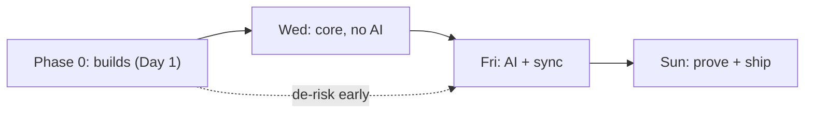

# Speedrun — Implementation Plan (MVP)

> Concrete, file-level plan to deliver the MVP described in [prd.md](prd.md),
> grounded in [CODEBASE.md](CODEBASE.md). Sequenced to the project's
> **Wednesday → Friday → Sunday** deadlines. Build first, add AI, then prove.

## Sequencing principle

The riskiest, slowest things are the **builds** (Anki from source, the mobile
engine, the sync loop) — not the features. Do those on Day 1. AI is forbidden
before Friday, so Wednesday is pure plumbing + the Rust change.

Legend for task acceptance: each task lists **Files**, **Steps**, and **Done when**.

---

## Phase 0 — Builds & environment (do first, Day 1)

### 0.1 Desktop builds from source

- **Steps:** `just run` succeeds and launches Anki; `just check` passes on a clean checkout.
- **Done when:** a clean machine can build + launch, recorded.

### 0.2 Make a trivial Rust change visible end-to-end (smoke test)

- **Goal:** prove the proto → Rust → Python → UI loop before doing real work.
- **Files:** `proto/anki/scheduler.proto` (or `i18n`), a `*/service.rs`, observe in `qt/aqt`.
- **Steps:** add a throwaway RPC returning a constant; `just build`; call it from a Python shell (`col._backend.<method>(...)`).
- **Done when:** the new value appears via Python. Then revert.

### 0.3 Mobile engine runs on a device/emulator

- **Decision (PRD):** Android companion based on AnkiDroid (reuses the Rust backend via JNI). iOS-via-FFI is the fallback.
- **Steps:** stand up the Android project, compile `rslib` for Android targets (`.so` via the AnkiDroid backend bindings), run on an emulator.
- **Done when:** the app launches on an emulator and opens a collection. **This is the single biggest schedule risk — unblock it Day 1.**

---

## Wednesday — Core works on both screens, no AI

### W1. GRE/AMC deck + topic taxonomy

- **Files:** new content data (deck `.apkg` or import script); a topic tag scheme on notes (e.g. `gre::calculus::series`, `gre::algebra::linear`).
- **Steps:**
  1. Define the GRE Math topic outline as a tag taxonomy (source of truth committed as a data file, referenced by the coverage map).
  2. Author/import an initial AMC-level problem deck, each note tagged with one or more GRE topics.
  3. Confirm tags load and are searchable (`tag:gre::calculus*`).
- **Done when:** a review loop runs on the deck and notes carry topic tags.

### W2. The Rust change — topic-aware interleaving queue (centerpiece, 20% of grade)

- **Why Rust (one-pager to write):** queue ordering is engine-level, shared by desktop + mobile, must respect FSRS/undo and run fast on 50k cards — not expressible as a Python post-filter without breaking the shared-engine rule.
- **Files:**
  - `proto/anki/deck_config.proto` — add a `ReviewInterleavingMode` enum + field to `DeckConfig.Config` (append at end; indices are wire-stable). Existing related enums: `ReviewCardOrder`, `ReviewMix` (lines 97-116).
  - `rslib/src/scheduler/queue/builder/mod.rs` — `QueueBuilder::build` (:186): after `sort_new()`, call the new interleaver. Thread config via `QueueSortOptions` (:96) / `sort_options()` (:227).
  - New `rslib/src/scheduler/queue/builder/topic_interleaver.rs` — weighted round-robin over topics ensuring consecutive cards differ; model on `intersperser.rs`.
  - Topic resolution: map `NoteId` → topic via note tags; weakness weight from existing `Card.memory_state.difficulty` / retrievability (`rslib/src/card/mod.rs:105`).
  - `rslib/src/deckconfig/mod.rs` — defaults for the new field.
- **Hard constraints (from CODEBASE gotcha #1/#2/#6):**
  - Permute only the gathered `Vec<DueCard>` / `Vec<NewCard>`. **Never** mutate `due`/`interval`/`memory_state`.
  - Do not call FSRS during queue build.
  - No new mutation path needed (ordering is in-memory in the built queue), so undo stays valid; verify it.
- **Tests (required deliverable):**
  - ≥3 Rust unit tests in/near `topic_interleaver.rs`: (a) consecutive cards differ in topic when possible, (b) weighting biases weak topics earlier, (c) degenerate cases (single topic, empty).
  - 1 Python test (`pylib/tests/`) that builds queues on a tagged deck and asserts the interleaved order + that **undo still works** and the collection passes integrity check.
- **Done when:** the diff + 3 Rust tests + 1 Python test pass via `just check`; undo verified; documented list of upstream files touched + merge-difficulty note.

### W3. Memory model — honest score + give-up rule

- **Approach:** use Anki's built-in **FSRS** as the memory model (already present, `rslib/src/scheduler/fsrs/`). No new model needed for memory.
- **Files:** a small read-only stats aggregation (extend `rslib/src/stats/`) exposing per-topic recall + a global memory estimate **with a range**.
- **Steps:**
  1. Implement the give-up rule (PRD default: ≥200 graded reviews AND ≥50% topic coverage) — return an "eligible/abstain" flag + reasons.
  2. Surface a memory score with a likely range (not a point) in a minimal UI readout.
- **Done when:** the app shows a memory score with a range, or abstains with a stated reason.

### W4. Coverage map

- **Files:** the topic taxonomy data file (W1) + the mastery/coverage query (see [CODEBASE 10.2](CODEBASE.md#102-topic-mastery-query-dashboard-data)).
- **Steps:** compute % of official-outline topics the deck covers; expose via RPC; gate readiness on it.
- **Done when:** coverage % is queryable and feeds the give-up rule.

### W5. Desktop installer on a clean machine

- **Files:** `qt/installer/` (Briefcase templates).
- **Done when:** an installer runs on a clean machine (recorded).

### W6. Mobile companion runs a real review session

- **Steps:** load the GRE/AMC deck on the Android build; run a real review session on the **shared Rust engine** (two-way sync not required yet).
- **Done when:** a review session on the phone is recorded; the W2 Rust change is verified working on the phone build.

**Wednesday proof bundle:** commit hash, clean-build recording, test results, clean-install recording, phone review-session recording.

---

## Friday — AI added & checked; phone syncs

### F1. Two-way sync (desktop ↔ phone)

- **Approach:** reuse the existing protocol + self-host `anki-sync-server` (see [CODEBASE 9.4](CODEBASE.md#94-self-hosting-for-desktopmobile)).
- **Steps:** run the server (`SYNC_USER1=... anki-sync-server`); point both clients at it; verify reviews flow both ways.
- **Done when:** a card reviewed on the phone appears on the desktop after sync (recorded), and the reverse.

### F2. Offline review + resync; conflict rule

- **Test (PRD 7b):** review 10 cards offline on phone + 10 different on desktop → reconnect → all 20 land once. Then review the **same** card offline on both → sync → documented winner.
- **Leverage (gotcha #3):** revlog dedupe (`uniquify: false`) + mtime-based card conflict resolution already provide this; **document these as our conflict rules**.
- **Done when:** the 10+10 test shows no loss/double-count; the same-card conflict resolves to a documented winner.

### F3. Three scores with ranges on the phone

- **Steps:** expose memory/performance/readiness (with ranges + give-up rule) on the mobile UI, same logic as desktop.
- **Done when:** the phone shows all three scores with ranges and abstains correctly.

### F4. AI card generation + safety checks

- **Steps:**
  1. Generate cards/hints from one named source; every output **traceable** to that source.
  2. Build a 50-item gold set; run a checker; **block** cards failing a pre-set cutoff. Report correct / wrong / bad-teaching counts.
  3. Pre-serving **eval** on a held-out set (accuracy + wrong-answer rate) with the cutoff.
  4. **Beat a baseline** (keyword/vector search), shown side by side.
  5. **AI-off fallback:** app still produces scores with AI disabled; AI degrades cleanly when offline/rate-limited.
  6. **Leakage scanner:** flag any test item (or near-copy) in training data; prove clean.
- **Done when:** eval numbers + baseline comparison exist; AI-off still scores; leakage scan is clean.

### F5. Performance model (the memory→answering bridge)

- **Steps:** predict held-back exam-style question correctness from topic mastery, item difficulty, timing, coverage.
- **Paraphrase test (PRD 7d):** 30 cards × 2 reworded questions; compare recall vs reworded accuracy; **report the gap** (proves performance ≠ a copy of memory).
- **Done when:** performance accuracy on held-out items is reported with the paraphrase gap.

**Friday proof bundle:** eval numbers + baseline comparison; phone→desktop sync recording.

---

## Sunday — Prove it & ship both

### S1. Memory model calibration

- **Done when:** calibration chart + Brier/log-loss on held-out reviews.

### S2. Performance accuracy (held-out) — finalize from F5.

### S3. Readiness score mapping

- **Steps:** document the method mapping performance → GRE scale (200-990) **with a range** + confidence + coverage.
- **Done when:** readiness shows point + range + coverage% + confidence + "next best thing", or abstains.

### S4. Study-feature ablation (interleaving) — 3 builds

- **Builds (PRD §8):** (1) full app (interleaving on), (2) ablation (interleaving off — toggle the W2 config), (3) plain unmodified Anki.
- **Steps:** same learners/questions/time budget; pre-register the primary metric; report a range; **report null/negative results honestly**.
- **Done when:** the three-build comparison is reported with the pre-registered metric.

### S5. Packaged builds

- **Done when:** desktop installer + signed Android APK, both run on clean devices with **AI off** and still score.

### S6. Reliability + benchmark

- **Crash test (PRD 7g):** kill each app mid-review 20× → zero corrupted collections.
- **Benchmark (PRD 7h / no recipe today):** add `just bench` wrapping `rslib/bench.sh`; extend `rslib/benches/benchmark.rs` with queue/scheduling/search benches; print p50/p95/worst on a 50k-card deck against the [PRD speed targets](prd.md#11-non-functional-requirements).
- **Done when:** crash test clean; one-command benchmark prints p50/p95/worst.

**Sunday deliverables (hand-in):** public AGPL repo (exam stated, build instructions for both apps, architecture overview, Rust-change note + files-touched list), 3-5 min demo video, one-page model descriptions (memory/performance/readiness + give-up rule), Brainlift.

---

## Cross-cutting checklists

### Adding any backend RPC

Follow [CODEBASE 6.3](CODEBASE.md#63-how-to-add-a-new-rpc-checklist). Remember: append-only RPCs, full `just build` after `.proto` edits, expose in `mediasrv.py` for web.

### Adding the readiness dashboard (web)

Follow [CODEBASE 8.3](CODEBASE.md#83-adding-a-new-page-eg-readiness-dashboard) — new SvelteKit route under `ts/routes/`, register in `is_sveltekit_page()`, open via `load_sveltekit_page(...)`. Do **not** modify the reviewer `#qa` pipeline (gotcha #4).

### Anything that mutates the collection

Wrap in `col.transact(Op::..., |col| { ... })` with `*_undoable` helpers (gotcha #6); add a test that undo works and integrity check passes.

---

## Grading-risk guardrails (avoid the hard caps)

| Requirement                           | Hard cap if missed | Owner task                            |
| ------------------------------------- | ------------------ | ------------------------------------- |
| Real Rust change                      | ≤50%               | W2                                    |
| Phone companion sharing engine + sync | ≤70%               | 0.3, W6, F1                           |
| Re-runnable test setup                | ≤60%               | tests in W2, evals F4/F5, ablation S4 |
| Held-out testing                      | ≤60%               | F4, F5, S1, S2                        |
| Either app runs on clean device       | ≤50%               | W5, S5                                |
| No leaked test data                   | that score = 0     | F4 leakage scanner                    |
| AI sources traceable                  | AI section = 0     | F4                                    |
| Honest readiness numbers              | automatic fail     | W3 give-up rule, S3 ranges            |
