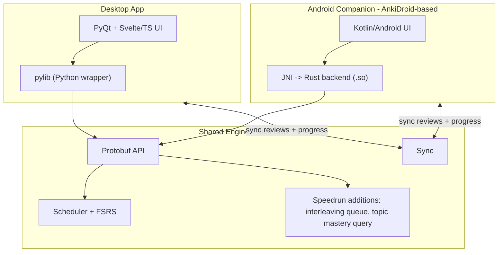

# Speedrun — Product Requirements Document (MVP)

> A desktop + mobile study app, forked from Anki, that prepares students for the
> **GRE Mathematics Subject Test** by drilling interleaved, competition-level
> (AMC) problems. One shared Rust engine, two apps, three honest scores.

- **Status:** Draft v0.1 (MVP)
- **Owner:** Amy Lin
- **Exam (locked):** GRE Mathematics Subject Test
- **License:** AGPL-3.0-or-later, with credit to Anki (some Anki components are BSD-3-Clause)
- **Source references:** `brainlift_speedrun.pdf` (learning-science thesis), `Speedrun_ A Desktop + Mobile Study App Built on Anki.pdf` (project requirements)

---

## 1. Background & Motivation

Standardized GRE math prep relies on **blocked, scaffolded** practice: students
drill one problem type at a time. This produces high _immediate_ performance but
an _illusion of mastery_ — high retrieval strength that is temporary and
context-bound, with little durable transfer (Bjork & Bjork, 2011).

Speedrun takes a deliberately unconventional, learning-science-backed approach:

- **Desirable difficulties** — spacing, interleaving, and retrieval testing make
  study harder in the moment but maximize long-term storage strength.
- **Interleaving for strategy discrimination** — consecutive problems cannot be
  solved by the same procedure, forcing students to _choose_ the right strategy.
  Interleaved practice nearly doubled delayed-test scores vs. blocked practice
  (Taylor & Rohrer, 2010).
- **Productive failure** — struggling with hard, non-routine problems _before_
  seeing a solution builds deeper, transferable schemas (Kapur, 2014).
- **Asymmetric (hard-to-easy) transfer** — training on harder competition-level
  problems generalizes _downward_ to easier standardized items; the reverse does
  not hold (PNAS, 2010). The GRE Math Subject Test shares the AMC format (~3
  min/question, rapid deep pattern recognition), so AMC-level training makes the
  real exam feel like a "simplified subproblem."
- **Anxiety regulation** — repeated exposure to "not knowing at first glance"
  reframes cognitive tension as engagement rather than threat.

**Spiky point of view:** To prepare well for the GRE Math Subject Test, students
should train on _extreme-difficulty_ (easy-to-mid AMC level) problems. Initial
discouragement is expected and acceptable; the long-run payoff is speed,
flexibility, and calm under time pressure.

---

## 2. Problem Statement & The Three Scores

A flashcard app answers _"can you remember this fact?"_. A real exam asks more.
Speedrun must answer **three distinct questions** and show them **separately,
each with a range** — never one blended number:

1. **Memory** — chance the student recalls a taught fact right now. (Anki's FSRS
   already does this well.)
2. **Performance** — chance the student answers a _new, exam-style_ question
   correctly, including ones never seen.
3. **Readiness** — projected GRE Math score on the real scale, with a likely
   range and an honesty note on how sure we are.

### The Honesty Rule (non-negotiable)

The app may **not** show a readiness score unless it also shows:

- the evidence that produced the number,
- what data is still missing,
- how accurate past guesses turned out to be (calibration),
- the likely **range**, not just a point,
- the single best next thing to study.

A confident number without this is "a guess in a nice font" — an automatic fail.

### The Give-Up Rule (MVP default, tunable)

> No readiness score until the student has **≥ 200 graded reviews** AND
> **≥ 50% coverage** of the GRE Math topic outline.

When below the line, the app abstains and explains why.

---

## 3. Exam Specification — GRE Mathematics Subject Test

Build the app for the exam _as it works today_. (Confirm exact figures against
the current official ETS outline during implementation.)

- **Scale:** 200–990, reported in 10-point increments.
- **Format:** ~66 multiple-choice questions, ~2 hours 50 minutes (≈ 2.5 min/question).
- **Content (approximate weighting):**
  - **Calculus (~50%)** — single/multivariable, sequences & series, differential equations.
  - **Algebra (~25%)** — linear algebra, abstract algebra, number theory.
  - **Other (~25%)** — real analysis, discrete math, probability/statistics, geometry, topology, complex variables, numerical analysis.

**Coverage map:** Every topic in the official outline is enumerated; the dashboard
shows the % of topics the deck actually covers. A large deck that skips a
high-weight section (e.g. calculus) must not show "ready."

**Content note:** Study items are **AMC-level competition problems** (the
"desirable difficulty"), tagged to the GRE topic taxonomy. Performance and
readiness, however, are measured/projected against **GRE-style** items so we
measure transfer, not just AMC skill.

---

## 4. Target Users

- **Primary:** Prospective math/STEM graduate-school applicants (typically
  upper-level undergrads or recent grads) preparing for the GRE Math Subject
  Test, comfortable enough with challenge to tolerate productive struggle.
- **Secondary:** Self-studying competition-math alumni who want a structured,
  data-honest readiness signal.
- **Out of scope (MVP):** Middle/high-school AMC competitors, other exams, casual
  flashcard users.

### Persona — "Maya, the applicant"

Senior applying to math PhD programs. Studies at a desk in the evenings and on
her phone between classes. Wants to know, honestly, _what she'd score today_ and
_what to study next_ — and is willing to be humbled by hard problems if it pays
off on test day.

---

## 5. User Stories

### Studying

- As a student, I can open the desktop app and run a **review session** on my GRE
  deck, grading each problem (Again/Hard/Good/Easy) as in Anki.
- As a student, consecutive problems are **interleaved across topics** so I must
  decide _which_ strategy to use, not just repeat one.
- As a student, I attempt a hard problem _before_ seeing the worked solution
  (productive failure), then study the explanation.

### Mobile + sync

- As a student, I can review the **same deck** on my phone between classes.
- As a student, reviews I do **offline** on my phone **sync** to the desktop (and
  vice versa) with **no lost or double-counted** reviews.
- As a student, if I review the same card on two devices offline, sync resolves
  the conflict with a **clear, documented winner**.

### Scores & honesty

- As a student, I see **three separate scores** (memory, performance, readiness),
  each with a **range**.
- As a student, when there isn't enough data, the app **tells me it can't score
  yet** and what to do to unlock it.
- As a student, my readiness score shows **why** (evidence), **coverage %**, a
  **confidence** indicator, and **the next best thing to study**.

### AI (added after core works)

- As a student, AI-generated cards and hints come from a **named source**, and
  bad cards are **blocked** before I see them.
- As a student, the app **still gives a score with AI switched off**.

---

## 6. Architecture Overview

- **One engine:** All scheduling/scoring logic lives in Rust (`rslib/`). The
  Speedrun change ships to **both** desktop and phone because they compile the
  same engine.
- **Desktop:** the forked Anki desktop app (`pylib/` + `qt/` + `ts/`), main tool.
- **Mobile (recommended): Android companion based on AnkiDroid**, which already
  drives the shared Rust backend over JNI and includes review UI + sync. This is
  the fastest credible path to "two apps, one engine, working sync" for the MVP.
  - _Alternative considered:_ iOS via Rust C/FFI (Swift shell). Rejected for MVP
    due to Apple signing/TestFlight friction and more from-scratch UI work.
- **Sync:** Reuse Anki's existing sync protocol so reviews flow both ways without
  loss or double-counting; document the conflict-resolution rule.

---

## 7. The Rust Engine Change (required — brownfield)

We must change the **Rust engine**, not just Python/UI. Chosen for MVP (aligns
directly with our interleaving thesis):

### Primary: Topic-aware interleaving queue

A new review-queue ordering that guarantees **consecutive due cards come from
different topics** (strategy discrimination), optionally weighted by
**topic weight × student weakness** so the highest-value cards surface first —
while keeping **FSRS intervals valid** and **undo working**.

### Supporting: Mastery query

A backend call returning, per topic, **# cards mastered** and **average recall**,
fast enough to power the dashboard on 50,000 cards (used by performance/readiness
models and the coverage map).

### Deliverables for the Rust change

- New **protobuf message(s)** in `proto/anki/` and a Python-callable method via
  `_backend.py`.
- **≥ 3 Rust unit tests** + **1 Python test** that calls the change end to end.
- Proof that **undo still works** and the collection does not corrupt.
- A one-page note: **why this belongs in Rust, not Python**.
- A list of **upstream files touched** and an assessment of future-merge difficulty.
- Verified to also work on the **phone build**.

_Files likely touched:_ `rslib/src/scheduler/` (queue building), `proto/anki/scheduler.proto`,
`pylib/anki/_backend` bindings, plus a new topic/tag-weighting module in `rslib/src/`.

---

## 8. Study Feature & Ablation Test (learning science)

**Feature:** Interleaved, topic-mixed sessions.

**Hypothesis (state ahead of time):** _Mixing related topics within one session
(interleaving) will raise accuracy on new mixed-topic questions at equal study
time, compared with blocked practice._ Failure condition: no difference (or worse)
at equal study time — and "no difference" is a valid, reportable result.

**Three builds, same learners / questions / time budget:**

1. **Full app** — interleaving on.
2. **Ablation** — interleaving off (blocked), everything else identical.
3. **Baseline** — plain, unmodified Anki.

Report the pre-registered primary metric with a **range**, and **report results
that did not work**.

---

## 9. Scoring Models (build the bridges, grade the steps)

| Score           | What it estimates                | MVP method                                                     | Honesty requirement                                                    |
| --------------- | -------------------------------- | -------------------------------------------------------------- | ---------------------------------------------------------------------- |
| **Memory**      | Recall of a taught fact          | FSRS (Anki built-in)                                           | **Calibrated**: calibration chart + Brier/log-loss on held-out reviews |
| **Performance** | Correct on _new_ exam-style item | Model over topic mastery, item difficulty, timing, coverage    | Accuracy on **held-out** exam-style questions                          |
| **Readiness**   | Projected GRE score (200–990)    | Documented mapping from performance → scaled score, with range | Range + coverage % + confidence + give-up rule                         |

- **Step 1 (required):** memory calibration on held-back reviews.
- **Step 2 (required):** predict held-back exam-style question correctness.
- **Step 3 (required):** map question performance → score, with method + range.
- **Step 4 (bonus):** validate vs. real students with study history + practice scores.

### Required validity checks

- **Paraphrase test:** 30 cards × 2 reworded exam-style questions each; compare
  recall vs. reworded accuracy. If equal, performance is just copying memory —
  report the **gap**.
- **Leakage check:** script that scans training data for test items / near-copies
  and proves the set is clean (leaked data zeroes that score).

---

## 10. AI Features & Safety (added after core works; off by default-capable)

- **Card/hint generation** from a named source (e.g. a textbook chapter), with
  every AI output **traceable to that source**.
- **AI eval before students see anything:** accuracy + wrong-answer rate on a
  **held-out** set, with a **pre-set cutoff**; cards failing the cutoff are blocked.
- **Beat a baseline:** side-by-side showing the AI beats a simpler method
  (keyword or vector search).
- **Gold-set card check:** 50 known-correct Q&A pairs; generate 50 cards from one
  real source and report (correct & useful) / (wrong) / (correct but bad teaching).
- **Graceful degradation:** if the AI service is offline, rate-limited, or returns
  broken output, AI turns off cleanly and the app **still gives a score**.
- **Prompt-injection resistance** for source files with hidden/adversarial text.

---

## 11. Non-Functional Requirements

**Performance (report p50 / p95 / worst case on the shared 50k-card deck):**

- Button press acknowledged: **p95 < 50 ms** (desktop + phone).
- Next card after grading: **p95 < 100 ms**.
- Dashboard first load: **p95 < 1 s**; refresh **p95 < 500 ms** without freezing.
- Normal-session sync: **< 5 s** on a normal connection.
- Cold start: **< 5 s** desktop, **< 4 s** phone.
- No UI freeze > 100 ms. Memory bound on 50k cards stated for both platforms.

**Reliability:**

- **Crash test:** kill each app mid-review **20×** → **zero corrupted collections**.
- **Offline:** AI turns off cleanly; both apps keep working and still score.
- **One-command benchmark** (e.g. `make bench` / a `just` recipe) prints p50/p95/worst
  for each core action on the 50k-card deck.

---

## 12. Roadmap (Wed / Fri / Sun — build, then add AI, then prove)

> Rule: **No AI before Friday.** Each milestone needs _proof_, not a promise.
> Get Anki building, one Rust change visible in the desktop app, and the engine
> running on a phone — **before** anything else.

### Wednesday — Core works on both screens, no AI

- [ ] Anki forked and **building from source** (desktop).
- [ ] Rust change working **end to end** (diff + 3 Rust tests + 1 Python test).
- [ ] **Review loop** running on the GRE/AMC deck.
- [ ] **Memory model** with an honest score (range + give-up rule).
- [ ] **Desktop installer** runs on a clean machine.
- [ ] **Android** app builds/runs on device or emulator, loads the deck, runs a
      real review session on the shared engine (two-way sync not yet required).
- [ ] **Proof:** commit hash, clean-build recording, test results, clean-install
      recording, phone review-session recording.

### Friday — AI added & checked; phone syncs

- [ ] Note on what AI was built, why, and what was skipped; every output traceable.
- [ ] Pre-serving **eval** (accuracy + wrong-answer rate on held-out set, with cutoff).
- [ ] **Beats a baseline** (keyword/vector search), shown side by side.
- [ ] App still scores with **AI off**.
- [ ] **Two-way sync** works (phone↔desktop) with no lost/double-counted reviews;
      offline review then resync.
- [ ] Phone shows **three scores with ranges** and follows the give-up rule.
- [ ] **Proof:** eval numbers + baseline comparison; recording of a phone review
      appearing on desktop after sync.

### Sunday — Prove it & ship both

- [ ] Memory model **calibrated** (calibration chart + Brier/log-loss, held-out).
- [ ] Performance model accuracy on held-out exam-style questions.
- [ ] Score mapping written down, with range.
- [ ] Study feature tested with **three builds**, equal study time; honest report
      including null/negative results.
- [ ] **Packaged desktop installer** + **packaged Android build** (signed APK).
- [ ] **Sync conflict handling** correct and documented.
- [ ] Both apps run with **AI off** and still score.
- [ ] **Proof:** results report, model descriptions, Brainlift, clean-device
      install/run recordings for both builds.

---

## 13. Deliverables (Hand-in)

- **GitHub repo:** public AGPL-3.0-or-later fork crediting Anki; exam stated up
  front; build instructions for both apps; architecture overview; the Rust-change
  note; the list of files touched.
- **Demo video (3–5 min):** review session, Rust change in action, phone→desktop
  synced card, three scores with ranges, AI features, test results.
- **Model descriptions:** one page each for memory, performance, readiness
  (including the give-up rule).
- **Brainlift:** per class outline (`brainlift_speedrun.pdf`).

---

## 14. Success Metrics (aligned to grading)

- Rust change quality & fit to Anki — 20%
- Score accuracy & honest uncertainty — 20%
- Study feature on learning science (with ablation) — 15%
- AI checking & safety — 15%
- Re-runnable, held-out tests — 12%
- Two apps / one engine / working sync — 10%
- Useful product & clean UX (both apps) — 8%

**Hard limits to avoid:** no real Rust change (≤50%), no engine-sharing phone
companion with sync (≤70%), no re-runnable tests (≤60%), no held-out testing
(≤60%), either app fails on a clean device (≤50%). **Automatic fail:** made-up /
misleading readiness numbers. **Zeroes:** leaked test data; AI claims with no
traceable source.

---

## 15. Risks & Mitigations

- **Build/mobile setup eats the week** → Get Anki compiling + a trivial Rust
  change visible + engine running on a phone on **Day 1**.
- **Performance model just mirrors memory** → enforce the paraphrase test; report
  the gap explicitly.
- **Sync data loss / double counting** → reuse Anki sync; run the 10+10 offline
  test and a same-card conflict test; document the winner rule.
- **AI hallucinated/leaked content** → gold-set check + leakage scanner + cutoff
  blocking + source traceability; ship with AI toggle off.
- **Discouragement from hard problems** (product risk) → framing, streaks, and
  surfacing "productive struggle" as progress (UX, post-MVP polish).
- **GRE outline figures change** → confirm scale/weights against current ETS docs
  before locking the coverage map.

---

## 16. Out of Scope (MVP) / Future Ideas

- Other exams (MCAT/LSAT/GMAT/USMLE), iOS build, real-time (<1s) sync,
  end-to-end-encrypted/conflict-free sync, 100k-card scaling, notarized installers
  for all 3 desktop OSes, store-ready phone build, upstream Anki/AnkiDroid
  contribution, knowledge-graph study planning (must beat keyword/vector search
  with numbers to count).
